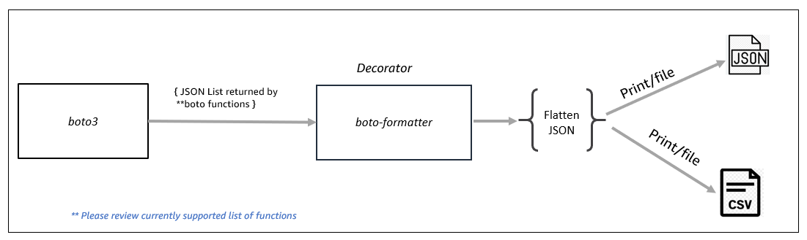

# boto_formatter
## What is boto _formatter?

The **boto_formatter(boto_magic_formatter)** is a tool that handles several common tasks when working with boto3 response data:
1. It automatically handles pagination of AWS responses, 
   stitching together data from multiple pages into a single output.
2. It flattens out nested JSON structures into a consistent tabular format. 
3. It allows you to output the processed data to a file, print it to standard out,
   send it to another command, or upload it to S3 (TBD).
4. It can convert the data to either csv or json format.
In summary, the boto_magic_formatter takes care of pagination, flattening, 
consistent output formatting, and output destination for AWS data, returning it as a csv or json file.


 [list of supported services and functions] (https://github.com/awslabs/boto-formatter/blob/main/docs/supported_services.md). 

## How it works?
You simply add decorator to your python function (The function which is returning   list from boto3 function) and it will convert the boto3 return list to flatten JSON or comma separate values (CSV). 

<p align="center">
  

By adding  decorator **@boto_magic_formatter** to a **generic function** as example shown below in  list_resources() function the response of the function will be converted to .csv . Generated csv response will also be saved in a file list_resources<date>.csv in a output folder located in the same directory of invoking python script. 
You can also notice the difference in lines of code when using boto_formatter and without boto_formatter to achieve the same result of parsing and flattening the json response.

```
import boto3
from boto_formatter.boto_magic_formatter import boto_magic_formatter
"""
Configuration options:
1. format_type: Options are csv or json .Default is json
2. output_to: Opitons are file or print or s3 : Default is None and just return flattend json
3. file_name: Option is custom file name : Default is None
4. Prefix_columns: Prepend static columns like AccountID to output
"""

@boto_magic_formatter(format_type="csv")
def list_resources(_session, service_name, function_name, result, attributes):
    """
    Place holder function. Decorator does all the magic.
    """
    return result

# Without boto_formatter
def list_policies_without_boto_formatter():
	client = boto3.client('iam')
	paginator = client.get_paginator('list_policies')
	result = []
	for page in paginator.paginate():
		for role in page['Policies']:
			json_obj = {}
			json_obj['PolicyName'] = role['PolicyName']
			json_obj['PolicyId'] = role['PolicyId']
			json_obj['Arn'] = role['Arn']
			json_obj['Path']=str(role['Path'])
			json_obj['DefaultVersionId'] = str(role['DefaultVersionId'])
			json_obj['AttachmentCount'] = str(role['AttachmentCount'])
			json_obj['PermissionsBoundaryUsageCount'] = str(role['PermissionsBoundaryUsageCount'])
			json_obj['IsAttachable'] = str(role['IsAttachable'])
			if "Description" in role.keys():
				json_obj['Description'] = str(role['Description'])
			json_obj['CreateDate'] = str(role['CreateDate'])
			json_obj['UpdateDate'] = str(role['UpdateDate'])
			if "Tags" in role.keys():
				json_obj['Tags_Key'] = role['Tags']['Key']
				json_obj['Tags_Value'] = role['Tags']['Value']
			result.append(json_obj)


		return result


if __name__ == "__main__":
	list_policies_fmt()
    _session = boto3.session.Session()
    # just pass the service name and function name and generate the csv file
    list_resources_to_file(_session, "iam", "list_policies", "")


```


## Installation 

**boto-formatter** is distributed on PyPI. Easiest way to install it is with pip

Create a virtual environment (optional):

```
python3 -m venv .venv
```
Activate enviornment:

```
source .venv/bin/activate
```

Install boto-formatter and boto3:

```
pip install boto-formatter
pip install boto3
```

Run boto-formatter code:

```
import boto3
from boto_formatter.boto_magic_formatter import boto_magic_formatter


"""
Configuration options:
1. format_type: Specify "csv" or "json" format (default is json)
2. output_to: Choose file, print/command, or S3 for output 
3. file_name: For file output, specify a custom file name 
4. Prefix_columns: Prepend static columns like AccountID to output
"""
@boto_magic_formatter(format_type="csv", output_to="file")
def list_resources_to_file(_session, service_name, function_name, result, attributes):
    """
    Place holder function. Decorator does all the magic.
    """
    return result


"""
Returns flatten JSON
"""
@boto_magic_formatter()
def list_resources(_session, service_name, function_name, result, attributes):
    """
    Place holder function. Decorator does all the magic.
    """
    return result

"""
Save .csv file on S3 bucket
"""
@boto_magic_formatter(format_type="json", output_to="s3", s3_bucket="rajeabh-cdk-test")
def list_resources_to_s3(_session, service_name, function_name, result, attributes):
    """
    Place holder function. Decorator does all the magic.
    """
    return result

"""
List all the supported services in boto_magic formatter
"""
def list_all_resoruces():
    _session = boto3.session.Session()
    service_function_list = list_configured_services()
    for service in service_function_list:
        service_name = service["service_name"]
        function_list = service["function_list"]
        for function_details in function_list:
            # Check if function doesn't take any input like Bucket Name
            print(function_details.keys())
            if "pagination_attributes" in function_details.keys():
                pass 
            else:
                print("Service :{} Function {} ".format(
                    service_name, function_details["function_name"]))
                print(list_resources(_session, service_name,
                      function_details["function_name"], ""))


if __name__ == "__main__":
    _session = boto3.session.Session()
    # just pass the service name and function name and generate the csv file
    list_resources_to_file(_session, "accessanalyzer", "list_analyzers", "")
    list_resources_to_file(_session, "s3", "list_buckets", "")
    list_resources_to_file(_session, "lambda", "list_functions", "")
    list_resources_to_file(_session, "iam", "list_roles", "")


    list_resources_to_s3(_session, "s3", "list_buckets", "")

    # If perticular function takes input you can pass input as a attribute like BucketName
    attributes = {"Bucket" : "rajeabh-tiktok"}
    list_resources_to_file(_session, "s3", "list_objects_v2", "",attributes)
```

For building Installation from source code click [here](https://github.com/awslabs/boto-formatter/blob/main/docs/setup.md)

[Check Addtional examples here](https://github.com/awslabs/boto-formatter/blob/main/tests)

## Usage
[Please click on each function to see the usage/example](https://github.com/awslabs/boto-formatter/blob/main/docs/supported_services.md)

Click on service to see the usage 
<table>
<tbody>
<tr>
<th>Service</th>
<th>Functions</th>
</tr>
<tr>
<th>General usage</th>
<th><a href="https://github.com/awslabs/boto-formatter/blob/main/tests/general_usage.py">General usage</a></th>
</tr>
<tr>
<td> <a href="https://github.com/awslabs/boto-formatter/blob/main/tests/accessanalyzer_usage.py">accessanalyzer</a></td>
<td>
<ul>
<li>1.list_analyzers</li>
<li>2.list_findings</li>
</ul>
</td>
</tr>
<tr>
<td> <a href="https://github.com/awslabs/boto-formatter/blob/main/tests/apigateway_usage.py">apigateway</a></td>
<td>
<ul>
<li>3.get_rest_apis</li>
</ul>
</td>
</tr>
<tr>
<td> <a href="https://github.com/awslabs/boto-formatter/blob/main/tests/budgets_usage.py">budgets</a></td>
<td>
<ul>
<li>4.describe_budgets</li>
</ul>
</td>
</tr>
<tr>
<td> <a href="https://github.com/awslabs/boto-formatter/blob/main/tests/cloudfront_usage.py">cloudfront</a></td>
<td>
<ul>
<li>5.list_distributions</li>
<li>6.list_functions</li>
</ul>
</td>
</tr>
<tr>
<td> <a href="https://github.com/awslabs/boto-formatter/blob/main/tests/cloudtrail_usage.py">cloudtrail</a></td>
<td>
<ul>
<li>7.list_trails</li>
</ul>
</td>
</tr>
<tr>
<td> <a href="https://github.com/awslabs/boto-formatter/blob/main/tests/cloudwatch_usage.py">cloudwatch</a></td>
<td>
<ul>
<li>8.list_dashboards</li>
<li>9.list_metrics</li>
</ul>
</td>
</tr>
<tr>
<td> <a href="https://github.com/awslabs/boto-formatter/blob/main/tests/codecommit_usage.py">codecommit</a></td>
<td>
<ul>
<li>10.list_repositories</li>
</ul>
</td>
</tr>
<tr>
<td> <a href="https://github.com/awslabs/boto-formatter/blob/main/tests/dynamodb_usage.py">dynamodb</a></td>
<td>
<ul>
<li>11.list_tables</li>
</ul>
</td>
</tr>
<tr>
<td> <a href="https://github.com/awslabs/boto-formatter/blob/main/tests/ec2_usage.py">ec2</a></td>
<td>
<ul>
<li>12.describe_addresses</li>
<li>13.describe_flow_logs</li>
<li>14.describe_instances</li>
<li>15.describe_network_acls</li>
<li>16.describe_route_tables</li>
<li>17.describe_security_groups</li>
<li>18.describe_security_group_rules</li>
<li>19.describe_snapshots</li>
<li>20.describe_subnets</li>
<li>21.describe_transit_gateways</li>
<li>22.describe_volumes</li>
<li>23.describe_vpcs</li>
<li>24.describe_vpc_endpoints</li>
<li>25.describe_vpc_peering_connections</li>
<li>26.describe_vpn_connections</li>
</ul>
</td>
</tr>
<tr>
<td> <a href="https://github.com/awslabs/boto-formatter/blob/main/tests/ecs_usage.py">ecs</a></td>
<td>
<ul>
<li>27.list_clusters</li>
<li>28.list_services</li>
<li>29.list_tasks</li>
</ul>
</td>
</tr>
<tr>
<td> <a href="https://github.com/awslabs/boto-formatter/blob/main/tests/efs_usage.py">efs</a></td>
<td>
<ul>
<li>30.describe_file_systems</li>
</ul>
</td>
</tr>
<tr>
<td> <a href="https://github.com/awslabs/boto-formatter/blob/main/tests/eks_usage.py">eks</a></td>
<td>
<ul>
<li>31.describe_cluster</li>
<li>32.list_clusters</li>
<li>33.list_fargate_profiles</li>
</ul>
</td>
</tr>
<tr>
<td> <a href="https://github.com/awslabs/boto-formatter/blob/main/tests/elasticache_usage.py">elasticache</a></td>
<td>
<ul>
<li>34.describe_cache_clusters</li>
</ul>
</td>
</tr>
<tr>
<td> <a href="https://github.com/awslabs/boto-formatter/blob/main/tests/elbv2_usage.py">elbv2</a></td>
<td>
<ul>
<li>35.describe_load_balancers</li>
</ul>
</td>
</tr>
<tr>
<td> <a href="https://github.com/awslabs/boto-formatter/blob/main/tests/emr-serverless_usage.py">emr-serverless</a></td>
<td>
<ul>
<li>36.list_applications</li>
<li>37.list_job_runs</li>
</ul>
</td>
</tr>
<tr>
<td> <a href="https://github.com/awslabs/boto-formatter/blob/main/tests/emr_usage.py">emr</a></td>
<td>
<ul>
<li>38.list_clusters</li>
<li>39.list_instance_fleets</li>
<li>40.list_notebook_executions</li>
<li>41.list_studios</li>
</ul>
</td>
</tr>
<tr>
<td> <a href="https://github.com/awslabs/boto-formatter/blob/main/tests/iam_usage.py">iam</a></td>
<td>
<ul>
<li>42.list_users</li>
<li>43.list_access_keys</li>
<li>44.list_account_aliases</li>
<li>45.list_attached_group_policies</li>
<li>46.list_attached_role_policies</li>
<li>47.list_attached_user_policies</li>
<li>48.list_group_policies</li>
<li>49.list_groups</li>
<li>50.list_policies</li>
<li>51.list_roles</li>
</ul>
</td>
</tr>
<tr>
<td> <a href="https://github.com/awslabs/boto-formatter/blob/main/tests/kms_usage.py">kms</a></td>
<td>
<ul>
<li>52.list_keys</li>
</ul>
</td>
</tr>
<tr>
<td> <a href="https://github.com/awslabs/boto-formatter/blob/main/tests/lambda_usage.py">lambda</a></td>
<td>
<ul>
<li>53.list_functions</li>
<li>54.list_layers</li>
</ul>
</td>
</tr>
<tr>
<td> <a href="https://github.com/awslabs/boto-formatter/blob/main/tests/organizations_usage.py">organizations</a></td>
<td>
<ul>
<li>55.list_accounts</li>
<li>56.list_policies</li>
</ul>
</td>
</tr>
<tr>
<td> <a href="https://github.com/awslabs/boto-formatter/blob/main/tests/rds_usage.py">rds</a></td>
<td>
<ul>
<li>57.describe_db_clusters</li>
<li>58.describe_db_instances</li>
<li>59.describe_db_security_groups</li>
<li>60.describe_db_snapshots</li>
<li>61.describe_global_clusters</li>
</ul>
</td>
</tr>
<tr>
<td> <a href="https://github.com/awslabs/boto-formatter/blob/main/tests/redshift-serverless_usage.py">redshift-serverless</a></td>
<td>
<ul>
<li>62.list_namespaces</li>
<li>63.list_workgroups</li>
</ul>
</td>
</tr>
<tr>
<td> <a href="https://github.com/awslabs/boto-formatter/blob/main/tests/redshift_usage.py">redshift</a></td>
<td>
<ul>
<li>64.describe_clusters</li>
</ul>
</td>
</tr>
<tr>
<td> <a href="https://github.com/awslabs/boto-formatter/blob/main/tests/route53_usage.py">route53</a></td>
<td>
<ul>
<li>65.list_cidr_blocks</li>
<li>66.list_hosted_zones</li>
<li>67.list_hosted_zones_by_vpc</li>
<li>68.list_vpc_association_authorizations</li>
</ul>
</td>
</tr>
<tr>
<td> <a href="https://github.com/awslabs/boto-formatter/blob/main/tests/route53domains_usage.py">route53domains</a></td>
<td>
<ul>
<li>69.list_domains</li>
<li>70.list_prices</li>
</ul>
</td>
</tr>
<tr>
<td> <a href="https://github.com/awslabs/boto-formatter/blob/main/tests/s3_usage.py">s3</a></td>
<td>
<ul>
<li>71.create_bucket</li>
<li>72.list_buckets</li>
<li>73.list_multipart_uploads</li>
<li>74.list_objects_v2</li>
</ul>
</td>
</tr>
<tr>
<td> <a href="https://github.com/awslabs/boto-formatter/blob/main/tests/sns_usage.py">sns</a></td>
<td>
<ul>
<li>75.list_subscriptions</li>
<li>76.list_topics</li>
</ul>
</td>
</tr>
<tr>
<td> <a href="https://github.com/awslabs/boto-formatter/blob/main/tests/sqs_usage.py">sqs</a></td>
<td>
<ul>
<li>77.list_queues</li>
</ul>
</td>
</tr>
</tbody>
<table>


## License
This library is licensed under the MIT-0 License. See the LICENSE file.


## Considerations
- When the format_type is selected as "csv" ;boto_formatter will skip the columns which contains "," in value.
- Majority of the cases Library returns formatted response of all the attributes that Python SDK provides. However, it doesn't assure 100 % coverage of all the attributes that Python SDK provides.
- Library is not designed for latency-based requirements. So, if you have high latency requirements, please evaluate library in lower enviornments (dev,QA) before using in high latency-based environment.


