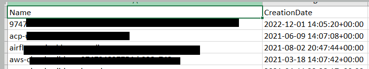

## Prerequisites

Python is required to run the boto_formatter.
Download python https://www.python.org/downloads/ 


## Setup 
### 1. Clone the Repository
Clone the boto_formatter github repository to your computer using the following command
```
git clone https://github.com/awslabs/boto-formatter
```

### 2. Generate distribution archives from source code 

**Unix/macOS**
```
cd boto_formatter

python3 -m pip install --upgrade build

python3 -m build
```

**Windows**
```
cd boto_formatter

py -m pip install --upgrade build

py -m build
```
Running build command will generate dist folder and creates following two files in the dist directory: 

1. **boto_formatter-1.0.0.tar.gz** 
2. **boto_formatter-1.0.0-py3-none-any.whl**


### 3. Create project directory 
```
mkdir boto3_formatter_test
cd  boto3_formatter_test

```
Copy the distribution file **boto_formatter-1.0.0.tar.gz** to project directory.

To test the functionality, copy any usage file example s3_usage.py from **tests/s3_usage.py** to project directory 

### 4. Create Python virtual environment and install libraries
Follow the instruction depending upon your OS

**Instruction for : Unix/macOS**

4.1 Create virtual environment
```
python3 -m venv .venv
```
4.2 Activate python virtual environment
```
source .venv/bin/activate
```
4.3 Install boto_formatter library and boto3 sdk 
```
pip install boto_formatter-1.0.0.tar.gz
pip install boto3

```
**Instruction for : Windows**

4.1 Create virtual environment
```
python -m venv .venv
```
4.2 Activate python virtual environment
```
cd .venv/scripts
activate
```
4.3 Go up to the directory to project directory 
```
cd .. 
cd ..
```

4.4. Install boto_formatter library and boto3 sdk 
```
pip install boto_formatter-1.0.0.tar.gz
pip install boto3

```

**You have successfully installed boto_formatter**

# Test

Run the s3_usage.py

**Unix/macOS**
```
python3 s3_usage.py
```

**Windows**
```
python s3_usage.py
```

Output folder will be created with list of s3 buckets. Review the sample code (s3_usage.py) [https://github.com/awslabs/boto-formatter/blob/main/tests/s3_usage.py]

<p align="center">
  

## Optional: Explore additional features

You can generate the output as csv, json. You can also send the output to file or print on command prompt.To explore these options (click here)[https://github.com/awslabs/boto-formatter/blob/main/tests/general_usage.py]


# Cleanup

1. Delete the Output folder 
2. Uninstall pip uninstall boto_formatter-1.0.0.tar.gz
3. Uninstall pip uninstall boto3
